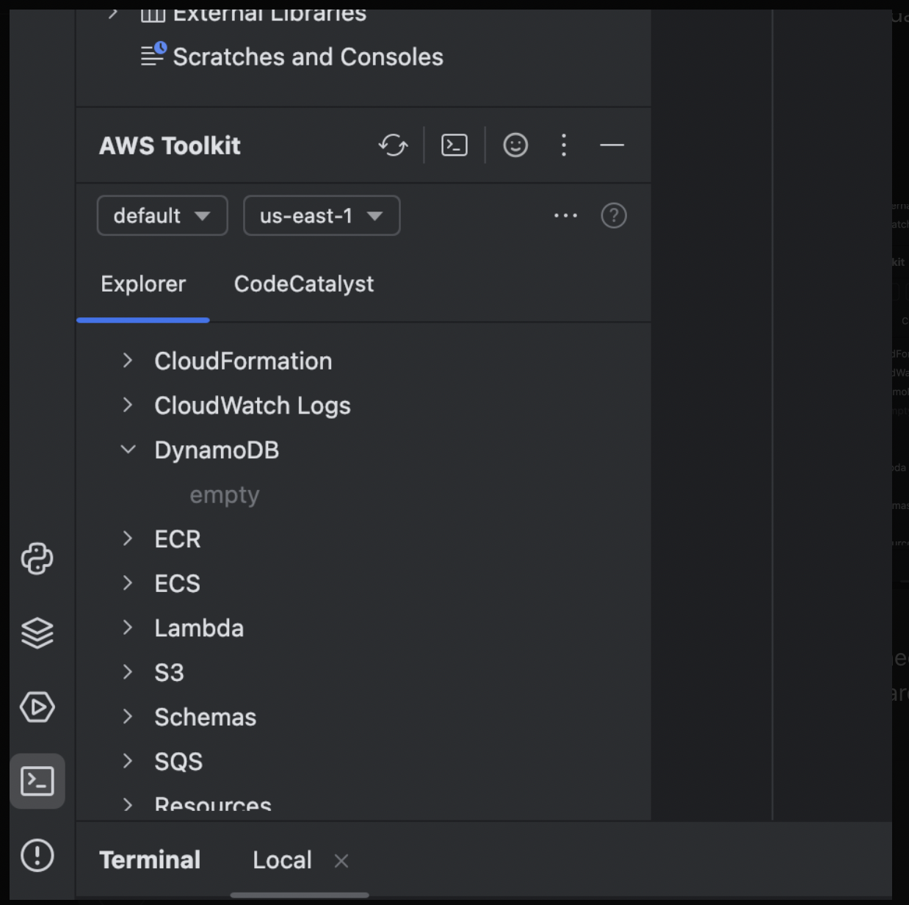

# ☁️ Cloud Computing Project - Assignment 1

This is a collaborative cloud-based project developed as part of an in-class assignment for the **Cloud Computing** course.

> 📄 **Assignment Specification**  
Please refer to: `COSC2626_2640_2025S1_A1`

---

## 📌 Project Info

- **Language**: Python 3.12.4  
- **IDE**: PyCharm  
- **Cloud Platform**: AWS (via AWS Academy Learner Lab)

---

## 🚀 Getting Started (for Team Members)

### 🔐 AWS Credentials Setup

For team members using PyCharm (or any other IDE — as long as the **AWS Toolkit plugin** is installed):

1. **Launch your AWS Academy Learner Lab**  
   (via Canvas or AWS Educate dashboard)

2. **Open AWS Toolkit → Edit AWS Credentials File** in your IDE.

3. **Paste your credentials** from the Learner Lab into the credentials file:

> 🔍 You can find your temporary credentials in the Learner Lab interface.  
> For more details, refer to **Week 3 Lab instructions**.

<pre><code>[default]
aws_access_key_id = YOUR_ACCESS_KEY_ID
aws_secret_access_key = YOUR_SECRET_ACCESS_KEY
aws_session_token = YOUR_SESSION_TOKEN
</code></pre>

4. **Verify successful connection**  
   Once configured correctly, you should see AWS services (like DynamoDB and S3) listed in the AWS Toolkit sidebar:

   

---

### 📥 Required Project Files

Make sure the following files are present in your working directory:

- `main.py`
- `dynamo_manager.py`
- `s3_manager.py`
- `2025a1.json` (data source)

---

### ▶️ Running the Program

Once your AWS connection is set:

You can run the project in your local environment
This will:
    1. Create a DynamoDB table automatically
    2. Load and populate data from 2025a1.json into the table
    ⚠️ Currently, data insertion is done one-by-one, so performance might be slow for large datasets. Haven't refined it yet.
