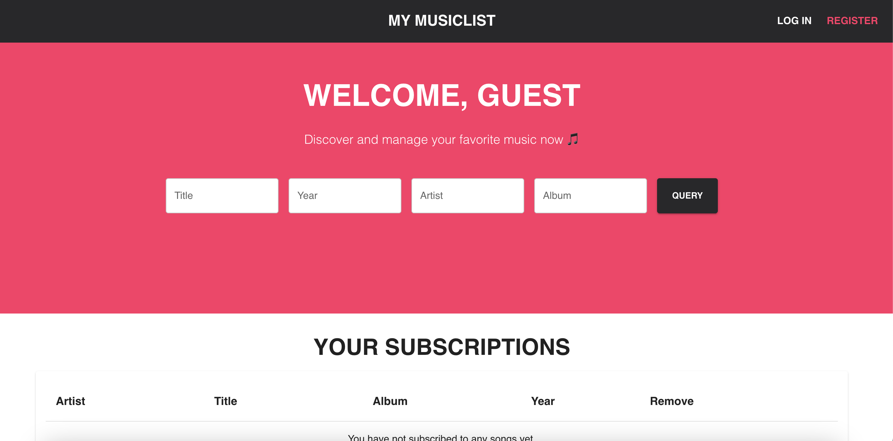
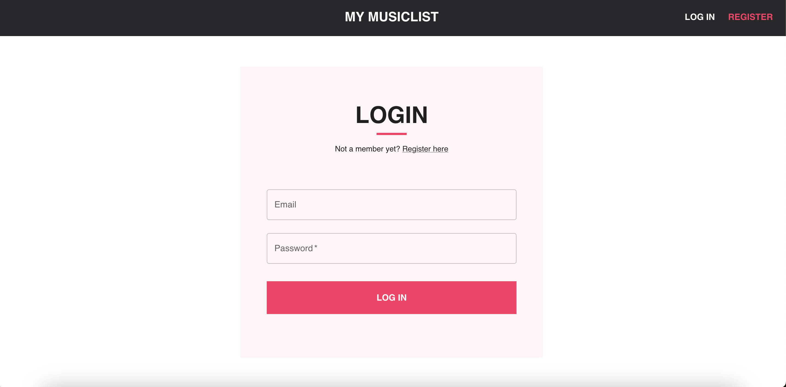
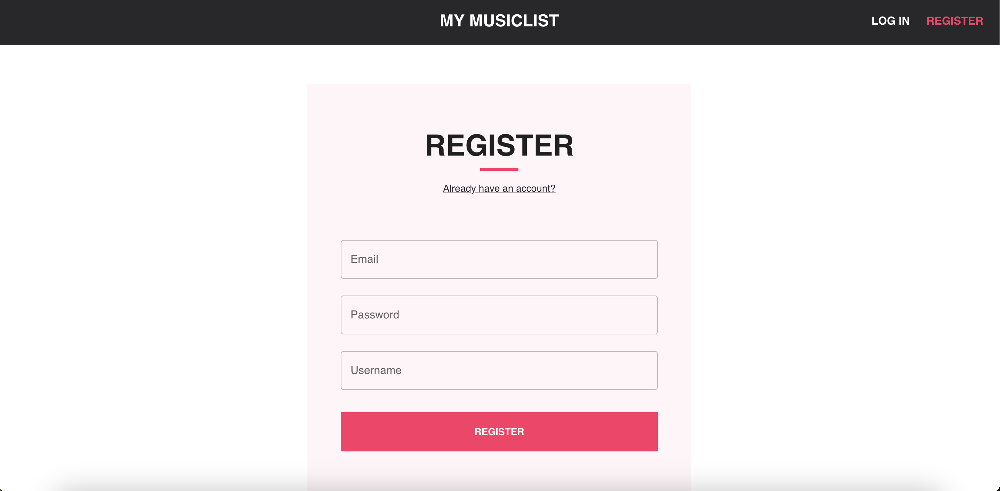
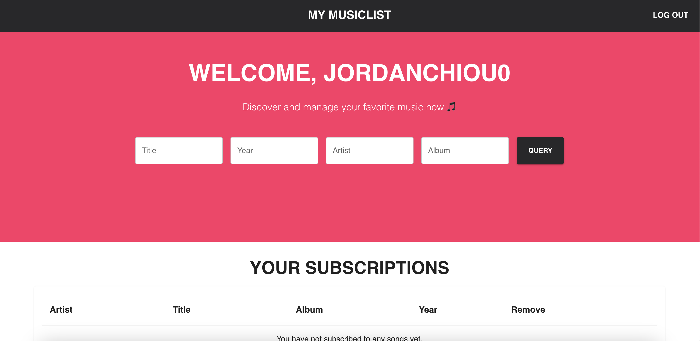
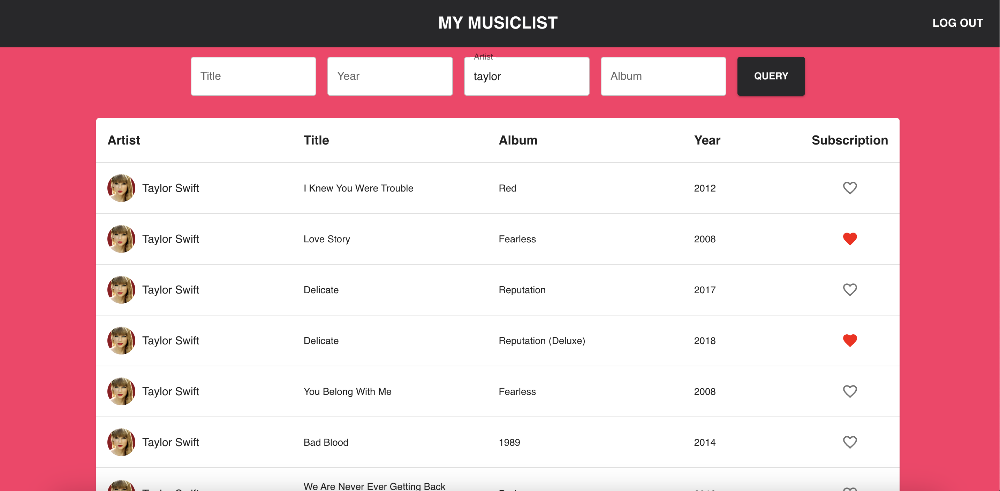
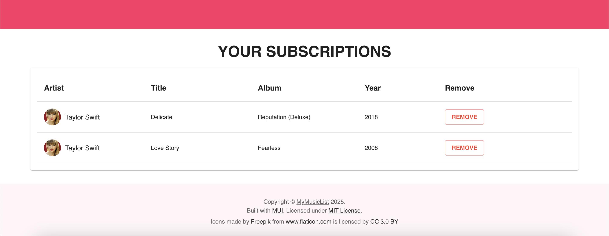
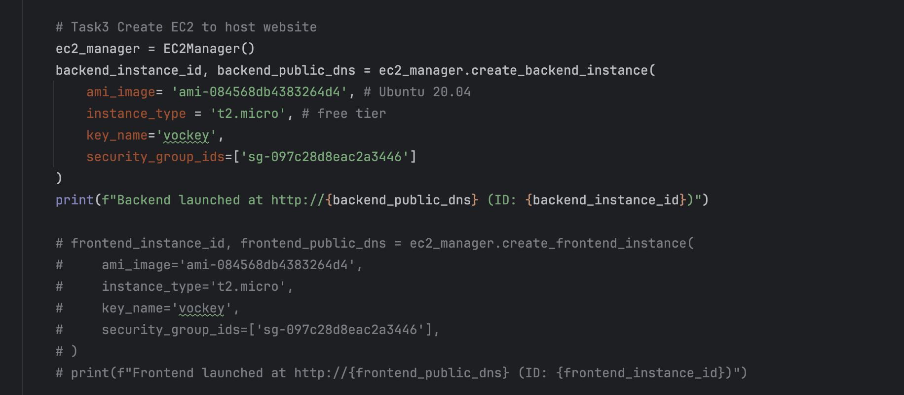

# 🎵 MyMusicList – AWS Cloud Full-Stack Music App

A serverless-ready, full-stack music platform built with **React** (frontend), **FastAPI** + **Python** (backend), and multiple **AWS Cloud** services.  
Users can register, log in, search for songs, and subscribe to their favorite tracks—all powered by a modern cloud architecture.

---

## 🚀 Project Overview

This project was designed as a hands-on AWS cloud practice, featuring:

- **Three main interfaces:** Login, Register, and Main Page
- **Core features:**
  - Secure user registration & authentication
  - Song search (filter by title, artist, album, year, etc.)
  - Subscribe/unsubscribe to music (only after registration & login)
- **Frontend:** React
- **Backend:** Python + FastAPI (EC2 hosted)
- **Cloud:** AWS S3, DynamoDB, EC2, API Gateway, Lambda

---

## ☁️ Cloud & Architecture Highlights

- **Serverless functions** with AWS Lambda:
  - User registration
  - Song subscription
- **REST API** endpoints for login and song search (handled on EC2 backend)
- **DynamoDB** for user information, music records and user subscriptions (partition key: email, sort key: musicId)
- **S3** for static asset and data storage
- **API Gateway** as the main entrypoint for serverless endpoints

---

## 🖥️ System Flow

1. **Register:** User registration handled by Lambda (serverless)
2. **Login:** Auth API served via EC2 backend (FastAPI)
3. **Main Page:**
   - Song search: Real-time querying or scanning to DynamoDB via backend
   - Subscribe/Unsubscribe: Handled by Lambda (serverless)
   - Subscribed music records displayed after login

---

## 📸 Screenshots

<table>
  <tr>
    <td valign="top"></td>
    <td valign="top"></td>
    <td valign="top"></td>
  </tr>
  <tr>
    <td align="center">Main Page (Without Login)</td>
    <td align="center">Login Page</td>
    <td align="center">Register Page</td>
  </tr>
</table>

<table>
  <tr>
    <td valign="top"></td>
    <td valign="top"></td>
    <td valign="top"></td>
  </tr>
  <tr>
    <td align="center">Main Page (With Login)</td>
    <td align="center">Searching Music</td>
    <td align="center">Subscriptions</td>
  </tr>
</table>

---

## 🛠️ Tech Stack

- **Frontend:** React, JavaScript
- **Backend:** Python 3.12, FastAPI
- **Cloud:** AWS EC2, S3, DynamoDB, Lambda, API Gateway
- **Infrastructure:** AWS Academy Learner Lab environment

---

## 📦 Dependencies

### Backend (`requirements.txt`)

- fastapi==0.115.1
- uvicorn==0.34.0
- boto3==1.35.57
- requests==2.31.0
- jinja2==3.1.3
- email-validator==2.2.0
- python-dotenv==1.0.1
- bcrypt==4.0.1
- python-jose==3.3.0

### Frontend (`package.json` excerpt)

- @mui/icons-material ^7.0.1
- markdown-to-jsx ^7.7.4
- react-router-dom ^7.4.1

> _For full frontend dependencies, see [`frontend-react/package.json`](frontend-react/package.json)._

---

## ⚡ How to Run This App

1. **Download or clone** the project, and open it with your preferred IDE (e.g., PyCharm, VSCode).

2. **Connect your IDE's AWS plugin** to your AWS account  
   (Make sure your AWS credentials are set up correctly, so all AWS services—like DynamoDB, EC2, Lambda, etc.—can be initialized by the code.)

3. **Run the initialization script:**  
   Go to the `scripts/` folder and run [`init_aws.py`](scripts/init_aws.py).

   > **Important:**  
   > In `init_aws.py`, **temporarily comment out the "frontend EC2" section** under Task 3 (see image below)—just run up to the backend part for now.  
   > 

4. **After the backend successfully launches,** you will see an output like:  http://{backend_public_dns}
   Copy this address, then update  
   [`frontend-react/src/config.js`](frontend-react/src/config.js)
   - Replace the value of `backendBaseURL:` with this new address.
5. **Go to [`backend/api/lambda_function/`](backend/api/lambda_function/)** and locate the two Python files.  
- Upload them to your AWS Lambda.
- Set up your own **API Gateway** so that it routes requests to these two Lambda functions.

6. **Once your API Gateway is created,**  
- Copy its endpoint URL,
- Then update [`frontend-react/src/config.js`](frontend-react/src/config.js)  
- Replace the value of `apiGatewayURL:` with your API Gateway link.

7. **Finally,** go back to [`scripts/init_aws.py`](scripts/init_aws.py) and **uncomment/run the frontend EC2 section** to bring up the React frontend.

8. **Now you should be able to access the full web app via your frontend EC2's public IP!**

---

## 📌 Notes

- User registration and music subscription are fully serverless (AWS Lambda)
- Login and song search are processed by the FastAPI backend (EC2)
- All data stored in DynamoDB; static resources on S3
- Only registered/logged-in users can subscribe to music

### ⚠️ AWS Learning Lab Configuration Note

> This project was developed and tested within an **AWS Academy Learner Lab** environment.  
> Some configurations—especially IAM roles, instance profiles, and resource names—are tailored to the Learning Lab setup.
>
> - **If you are running this project outside the Learning Lab, please update IAM-related settings as needed.**
> - For example, review and modify the `IamInstanceProfile` configuration in [`backend/core/ec2`](backend/core/ec2) to match your own AWS account setup, permissions, and security requirements.

---

## 💡 Learning Focus

- AWS Lambda for real-world serverless backend logic
- FastAPI as a cloud-friendly Python backend
- Integrating AWS services (DynamoDB, S3, API Gateway) for scalable apps
- Modern full-stack cloud architecture: EC2 + Lambda + API Gateway

---

## 🙏 Acknowledgements

- Project structure and AWS Academy resources based on the Cloud Computing course (RMIT)
- The UI is adapted from the MUI example at: https://github.com/mui/material-ui/blob/master/docs/src/pages/premium-themes/onepirate/SignIn.js It is licensed under the MIT license.

---
