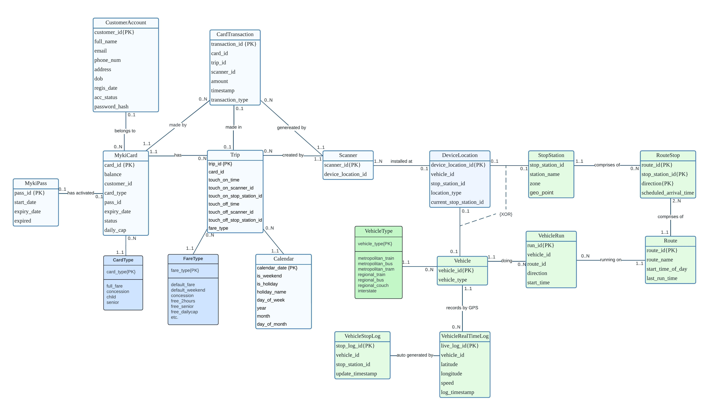
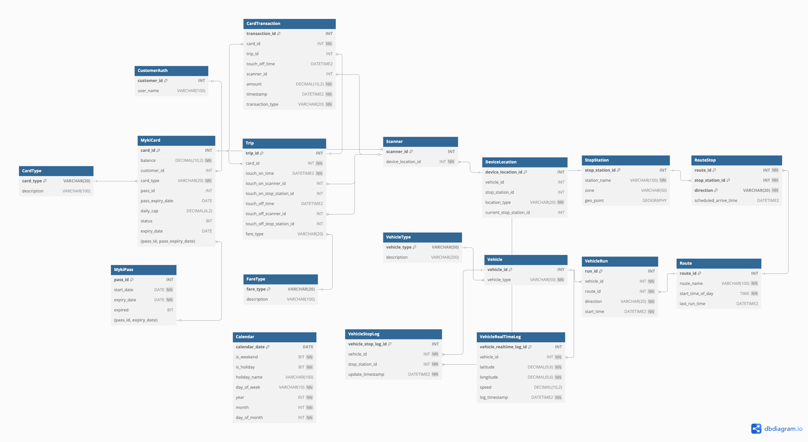
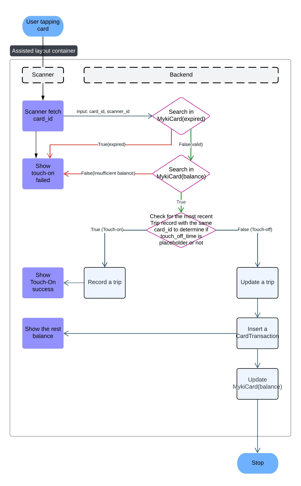

# 🚋 Myki Card Transportation System Database

A robust database project simulating a real-world metropolitan transit smartcard system (like Victoria’s Myki), focused on backend relational modeling, partitioning, and performance tuning—implemented in Microsoft SQL Server.

---

## 📚 Project Overview

This project replicates the core logic of Myki for public transport, including:

- Touch-on/touch-off trip event recording
- Fare calculation & capping
- Transaction tracking (deduction, top-up, refund)
- Vehicle & stop/station tracking (**with simulated GPS and location data**; no real hardware involved)
- Support for multiple transport modes (tram, train, bus)
- Storage & performance optimization for high-volume time-series data

> **Note:** This is a standalone backend system. No frontend or live API is included.

---

## 🏗️ Key Design Features

- **Advanced Relational Design:**  
  Fully normalized schema (3NF) with selected denormalization for real-time efficiency.
- **Table Partitioning:**  
  High-volume tables (Trip, CardTransaction, VehicleStopLog, VehicleRealTimeLog) use *monthly* partitioning; MykiPass uses *yearly* partitioning for efficient long-term storage.
- **Vertical Partitioning:**  
  Customer authentication vs. profile data split for access efficiency.
- **Comprehensive Indexing:**  
  Composite and filtered indexes tailored for touch-on/touch-off and trip retrieval.
- **Full Data Dictionary:**  
  All tables/fields/constraints fully documented—see [`specification.pdf`](s4068959_Database%20Specifications.pdf) and SQL seed files.
- **Sample Data & Procedures:**  
  Scripts include vertical/horizontal partitioning setup, schema DDL, indexing, and T-SQL stored procedures for touch-on logic, fare deduction, etc.
- **Scalable Storage Planning:**  
  Growth and storage needs projected 10+ years, based on Victorian ridership and population data.

  Simulates card tap, determines touch-on/off, invokes correct logic.
- `usp_CheckTapCardStatus`  
  Checks for expired cards, negative balances.
- `usp_ProcessTouchOffTransaction`  
  Completes trip, calculates fare, creates transaction, updates balance.
- All logic is described in the [specification, Appendix B](s4068959_Database%20Specifications.pdf).

---

## 🗂️ Database Structure

| Table Name           | Key Purpose                                             |
|----------------------|--------------------------------------------------------|
| `CustomerAccount`    | Registered user profile & authentication (vertically partitioned) |
| `MykiCard`           | Card info, type, balance, association to customer      |
| `CardTransaction`    | Fare/top-up/refund log, linked to trip & card          |
| `Trip`               | Travel history, touch-on/off records                   |
| `Scanner`/`DeviceLocation` | Physical scanner/devices and their locations          |
| `StopStation`        | Stations/stops with geo data and zones                 |
| `Vehicle`, `VehicleRun` | Vehicles and scheduled/real-time runs                   |
| `VehicleStopLog`, `VehicleRealTimeLog` | GPS logs and stop arrival records                |
| `Calendar`           | Holiday/weekend info for fare calculation              |
| `CardType`, `FareType`, `VehicleType` | Lookup/reference tables                         |

- See full schema and field details in: [`specification.pdf`](s4068959_Database%20Specifications.pdf)  

**Entity-Relationship Diagram:**  

---

## 💾 Storage, Performance, & Partitioning

- **Partitioning:**  
  Monthly range for trip/transaction/log tables. Yearly for long-lived pass data.
- **Storage Projections:**  
  ~93GB/year for operational data in 2023, scaling to ~105GB/year by 2033. Static tables ≈1GB.
- **Indexing:**  
  Key indexes target touch-on, unfinished trip detection, and transaction-lookup bottlenecks.
- **Recovery:**  
  Deterministic—recreate via version-controlled SQL scripts (`.sql` files in this repo).

**Physical Structure Diagram:**  

---

## 🚦 Key Stored Procedures & Process

- `usp_TouchOn`  
  Simulates card tap, determines touch-on/off, invokes correct logic.
- `usp_CheckTapCardStatus`  
  Checks for expired cards, negative balances.
- `usp_ProcessTouchOffTransaction`  
  Completes trip, calculates fare, creates transaction, updates balance.
- All logic is described in the [specification, Appendix B](s4068959_Database%20Specifications.pdf).

**Touch-On Process Flow:**  

---

## ⚙️ Setup & Deployment

1. **Clone this repo and open in Azure Data Studio / SSMS.**
2. **Execute SQL scripts in order:**  
   - `VerticalPartition.sql` – Customer tables & view  
   - `HorizontalPartitions.sql` – Partition schemes  
   - `MykiTransportDB_DDL.sql` – Main tables/constraints  
   - `Index.sql` – Indexes  
   - `seedXX.sql` – Populate sample data (run in order)
3. **Testing:**  
   - Use `usp_TouchOn(card_id, scanner_id)` to simulate tap-on/off  
   - Test with sample card, scanner, and station data

> Full setup and data population instructions in Section 2.7 of the [specification](s4068959_Database%20Specifications.pdf).

---

## 🛠️ Environment

- **DBMS:** Microsoft SQL Server 2022 (Developer Edition)
- **Tools:** SSMS 19.x, Azure Data Studio 1.46+
- **Platform:** macOS/Windows (local VM or Docker)
- **All scripts are compatible with teaching/lab environment.**

---

## 📈 Storage & Scalability

- **2023 Estimated Storage:** ~93GB/year
- **2033 Projected Storage:** ~105GB/year
- *Details and calculations in Appendix C of the [specification](s4068959_Database%20Specifications.pdf)*

---

## 📖 Documentation & References

- Full PDF: [`s4068959_Database Specifications.pdf`](s4068959_Database%20Specifications.pdf)
- References include PTV GTFS feeds, population projections, and fare structure docs (see Section 1.4).

---

## 📝 Educational Notice

This database system is an **academic coursework project** for RMIT University, developed for learning and demonstration.  
It is not for real-world deployment—no production security, user auth, or real card data is used.

**Contact:**  
- Jordan Chiou (Designer)  
- [jungdechiou@gmail.com](mailto:jungdechiou@gmail.com)  
- s4068959@student.rmit.edu.au

---
